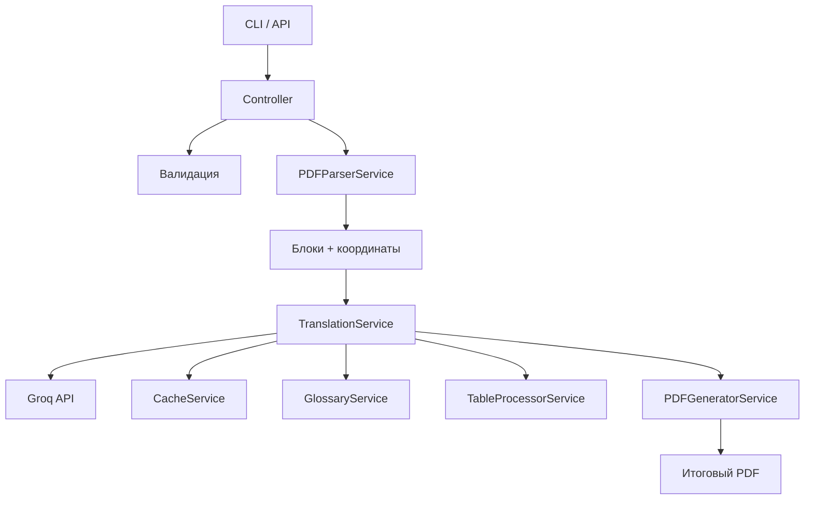

# PDF Technical Translator

> LLM-based перевод технических PDF-документов с сохранением структуры

Проект автоматически переводит технические PDF-документы (руководства, спецификации, патенты), сохраняя заголовки, абзацы, таблицы и базовое форматирование.

**LLM бэкенд:** Groq API (LLaMA 3, Mixtral) с возможностью замены на DeepSeek или OpenAI.  
**Архитектура:** сервис-ориентированная, поддерживает CLI и REST API.

---

## 🎯 Ключевые возможности

- Извлечение текста и таблиц с координатами (`pdfplumber`)
- Умная сегментация на логические блоки (заголовки, параграфы, списки)
- Перевод с учётом контекста (overlap 2–5 абзацев)
- Глоссарий для точной передачи технических терминов
- Кэширование переводов (SQLite) для повторных запусков
- Генерация переведённого PDF (`pypdf` / `reportlab`)
- CLI + опционально REST API (FastAPI)

---

## 🧱 Архитектура



---

## 📁 Структура проекта

```
pdf_translator/
├── src/
│   ├── main.py                          # Точка входа: CLI (click) или запуск сервера
│   │
│   ├── api/                             # HTTP слой (опционально)
│   │   ├── routes.py                    # Регистрация эндпоинтов
│   │   ├── controllers/
│   │   │   ├── translate_controller.py  # POST /translate
│   │   │   └── health_controller.py     # GET /health
│   │   └── middleware/
│   │       └── auth.py                  # Логирование, CORS, rate-limiting
│   │
│   ├── services/                        # Бизнес-логика
│   │   ├── pdf_parser_service.py        # Извлечение блоков через pdfplumber
│   │   ├── translation_service.py       # Работа с Groq, промпты, overlap, батчинг
│   │   ├── pdf_generator_service.py     # Сборка PDF (pypdf/reportlab)
│   │   ├── glossary_service.py          # Загрузка и подстановка терминов
│   │   ├── cache_service.py             # Кэш (SQLite/Redis)
│   │   └── table_processor_service.py   # Перевод таблиц (ячейка за ячейкой)
│   │
│   ├── core/                            # Общие утилиты и конфигурация
│   │   ├── config.py                    # Переменные окружения (API ключи, лимиты)
│   │   ├── exceptions.py                # Кастомные исключения
│   │   └── logging_config.py            # Настройка логов
│   │
│   ├── models/                          # DTO / Pydantic модели
│   │   ├── document.py                  # Document, Block, Table, BoundingBox
│   │   ├── translation.py               # TranslationRequest, TranslationResponse
│   │   └── glossary.py
│   │
│   ├── validation/
│   │   ├── request_schemas.py           # Pydantic схемы для API
│   │   └── pdf_validator.py             # Проверка PDF (размер, повреждённость, OCR)
│   │
│   └── cli/
│       └── translate_command.py         # CLI-команды
│
├── tests/
│   ├── unit/                            # Модульные тесты сервисов
│   ├── integration/                     # Интеграционные тесты
│   └── fixtures/                        # Тестовые PDF-файлы
│
├── data/
│   └── cache.sqlite                     # Кэш переводов
│
├── output/                              # Готовые переведённые PDF
│
├── docker/
│   └── Dockerfile
│
├── .env.example
├── requirements.txt
├── task.md                              # Детальный список задач
└── README.md
```

---

## 🔧 Роль каждого сервиса

| Сервис | Обязанности |
|---|---|
| `PDFParserService` | Извлечь текст, таблицы, координаты; разбить на логические блоки |
| `TranslationService` | Сформировать промпт, вызвать Groq, обработать overlap, использовать кэш |
| `CacheService` | Сохранить и достать перевод по хешу (текст + язык + глоссарий) |
| `GlossaryService` | Загрузить глоссарий из JSON/CSV, подставить термины в промпт |
| `TableProcessorService` | Преобразовать таблицу в Markdown, перевести ячейки, восстановить таблицу |
| `PDFGeneratorService` | Создать итоговый PDF (через pypdf или reportlab с сохранением макета) |
| Контроллеры | Принять запрос, вызвать нужные сервисы, вернуть ответ или `task_id` |
| Валидация | Проверить входной PDF, язык, размер, глоссарий до начала обработки |

---

## 🚀 Быстрый старт

### 1. Установка зависимостей

```bash
python -m venv venv
source venv/bin/activate   # Windows: venv\Scripts\activate
pip install -r requirements.txt
```

### 2. Настройка окружения

Скопируйте `.env.example` → `.env` и заполните:

```env
GROQ_API_KEY=your_key_here
DEFAULT_MODEL=llama3-70b-8192
CACHE_TYPE=sqlite       # или redis
PDF_STRATEGY=pypdf      # или reportlab
```

### 3. Запуск CLI

```bash
python src/main.py translate \
  --input doc.pdf \
  --output translated.pdf \
  --src en \
  --tgt ru \
  --glossary glossary.json
```

### 4. Запуск REST API (опционально)

```bash
python src/main.py serve --host 0.0.0.0 --port 8000
```

Пример запроса:

```bash
curl -X POST http://localhost:8000/api/v1/translate \
  -F "file=@doc.pdf" \
  -F "src_lang=en" \
  -F "tgt_lang=ru" \
  -F 'glossary={"PID":"ПИД-регулятор"}'
```

---

## 📋 Дорожная карта

Полный перечень задач с этапами, оценкой сложности и зависимостями — в файле [`task.md`](task.md).

| # | Этап |
|---|---|
| 1 | Извлечение и сегментация PDF |
| 2 | Перевод через Groq с overlap и кэшем |
| 3 | Обработка таблиц |
| 4 | Генерация переведённого PDF |
| 5 | CLI + API |
| 6 | Тестирование и оптимизация |

---

## 🛠 Технологический стек

| Слой | Технологии |
|---|---|
| Backend  | FastAPI, python 3.13.7 |
| Извлечение | `pdfplumber`, `pypdf` |
| LLM | Groq API (LLaMA 3, Mixtral) — заменяем на DeepSeek / OpenAI |
| Кэш | Redis |
| API | FastAPI (опционально) |
| Генерация PDF | `reportlab`, `pypdf` |
| Логирование | `loguru` / стандартный `logging` |