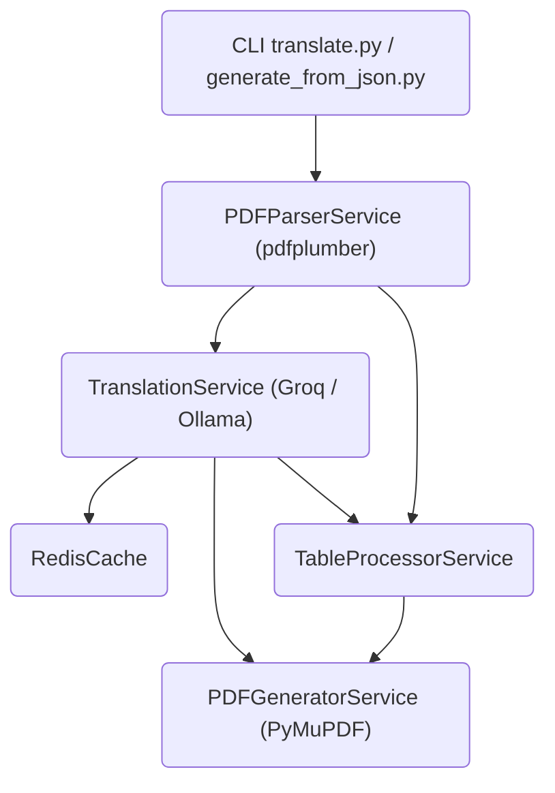

# PDF Technical Translator

> **LLM‑based перевод технических PDF‑документов с сохранением структуры, графики и таблиц**

Автоматический перевод сложных PDF (руководства, спецификации, патенты, декларации) с сохранением заголовков, абзацев, таблиц, изображений, шрифтов и форматирования.  
Использует **постраничный перевод** (один запрос на страницу), **батчинг**, **асинхронность** и **двухуровневое кэширование** (Redis).

**Бэкенды:**
- **Groq API** — быстро, платно, лимиты токенов
- **Ollama** — локально, бесплатно, безлимитно, CPU/GPU

**Архитектура:** сервис‑ориентированная, CLI + JSON‑экспорт.

---

## 🎯 Ключевые возможности

- Извлечение текста и таблиц с точными координатами каждого блока (`pdfplumber`)
- Умная сегментация: заголовки, параграфы, списки, таблицы (по шрифтам и положению)
- **Постраничный перевод** — один запрос LLM на страницу (с разбивкой, если блоков > 20)
- Контекст (overlap) не нужен — вся страница переводится целиком
- Глоссарий для точной передачи технических терминов
- **Два бэкенда:** Groq (облако) / Ollama (локальный)
- **Redis‑кэш** переводов (хеш текста + языки + глоссарий)
- **Rate limiting + retries** для Groq (лимит 30 запросов/мин)
- **Batching & asyncio** — ускорение в 5–10 раз на больших документах
- **Таблицы:** извлечение ячеек с координатами → перевод всей таблицы одним запросом → автоматический подбор шрифта и высоты строк
- **Генерация PDF:** наложение переведённого текста поверх оригинала через **PyMuPDF** (сохраняет графику, изображения, фоны)
- **Экспорт / импорт JSON** — ручная правка переводов, координат, шрифтов
- **CLI** с прогресс‑барами (`tqdm`) и гибкими параметрами

---

## 🧱 Архитектура



---

## 📁 Структура проекта

```
pdf_translator/
├── src/
│   ├── services/
│   │   ├── pdf_parser_service.py       # извлечение текста/таблиц, очистка, объединение блоков
│   │   ├── translation_service.py      # Groq API (asyncio, rate limiting, батчинг)
│   │   ├── ollama_service.py           # локальный Ollama (аналогичный интерфейс)
│   │   ├── cache_service.py            # Redis‑кэш
│   │   ├── table_processor_service.py  # перевод таблиц целиком (JSON‑матрица)
│   │   └── pdf_generator_service.py    # PyMuPDF: удаление оригинала + вставка перевода
│   ├── models/
│   │   └── document.py                 # Block, Table, BoundingBox
│   ├── core/
│   │   ├── config.py, exceptions.py, logging_config.py
│   └── main.py                         # CLI (translate.py)
├── translate.py                        # главный скрипт CLI
├── generate_from_json.py               # генерация PDF из отредактированного JSON
├── create_big_doc.py                   # создание 80‑страничного тестового PDF
├── requirements.txt
├── .env.example
├── README.md
├── PROJECT_STATUS.md
└── task.md
```

---

## 🚀 Быстрый старт

### 1. Установка

```bash
python3.12 -m venv .venv
source .venv/bin/activate
pip install -r requirements.txt
```

### 2. Настройка окружения

Скопируйте `.env.example` → `.env` и укажите параметры:

```env
GROQ_API_KEY=your_groq_api_key
GROQ_RATE_LIMIT_PER_MINUTE=30
GROQ_MAX_CONCURRENT=5
REDIS_HOST=localhost
REDIS_PORT=6379
```

### 3. Запуск перевода

**С Groq (облако):**

```bash
python translate.py --input doc.pdf --output out.pdf --src en --tgt ru --backend groq --model llama-3.3-70b-versatile --batch-size 20
```

**С Ollama (локально, безлимитно):**

```bash
python translate.py --input doc.pdf --output out.pdf --src en --tgt ru --backend ollama --model llama3:8b --batch-size 20
```

**Экспорт JSON для ручной правки:**

```bash
python translate.py --input doc.pdf --export-json data.json --src en --tgt ru --backend ollama
```

**Генерация PDF из отредактированного JSON:**

```bash
python generate_from_json.py --json data.json --output final.pdf
```

---

## 🧪 Тестирование

**Создайте 80‑страничный тестовый документ:**

```bash
python create_big_doc.py
```

**Переведите его (проверка производительности):**

```bash
python translate.py --input big_doc.pdf --output big_doc_trans.pdf --src en --tgt ru --backend ollama --batch-size 20
```

---

## 📦 Технологический стек

| Компонент        | Технологии                      |
|------------------|---------------------------------|
| Парсинг PDF      | pdfplumber                      |
| Генерация PDF    | PyMuPDF (сохраняет графику)     |
| LLM (облако)     | groq (async)                    |
| LLM (локально)   | ollama                          |
| Кэш              | redis                           |
| Асинхронность    | asyncio, httpx                  |
| Прогресс‑бары    | tqdm                            |
| Логирование      | loguru                          |
| CLI              | argparse                        |

---

## ⚠️ Известные ограничения

- OCR не реализован — текст извлекается только из текстового слоя.
- Сложные таблицы (без чётких границ) могут распознаваться неточно.
- Очень длинные строки в ячейках таблиц могут не влезть — уменьшается шрифт до 6 pt.
- PyMuPDF для удаления текста использует `redact_annot`, что может оставлять небольшие артефакты.
- Groq имеет суточные лимиты токенов (бесплатный tier — 100k). Для больших объёмов используйте Ollama или платный тариф.

---

## 🤝 Вклад и развитие

Следующие шаги (по вашему желанию):

- Веб‑редактор (FastAPI + PDF.js + Fabric.js)
- OCR для сканированных PDF (tesseract)
- Docker‑контейнер
- Улучшенное детектирование таблиц (camelot / tabula-py)

---

## 📄 Лицензия

MIT
